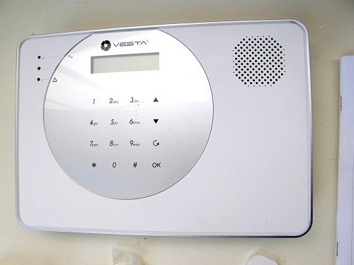

# Vesta-home-alarm-on-off-sensor
Connect Vesta home alarm output relay to ESP8266 (WEMOS mini D1) with MQTT to Home Assistant
This to show the status of the home alarm on any mobilephone or PC and have your
smarthouse respond to any changes of the alarm.

You need to have the installation code to your Vesta 1923 alarm panel to set the output relay to
on/off all = on, or to what ever you want in the relay output list of choise.
Edit the program with your wifi settings and MQTT settings
Flash program to Wemos.
Setup your Home Assistant configuration file with the sensor and MQTT server.
Connect the Ground and D3 of the Wemos to the relay output connector on the back of the alarm panel.
If you want visual indication connect common catode RGB LED to Wemos D0=red ,D5=green.

Have fun...

Diffrent name on the same Alarm Panel is:

 - C-Fence family 1923S
 - CTC-1923S
 - VST-1923

##Credits
ElectronHacks/MQTT_ESP8266_Garage_Door

Library#

#include <ESP8266WiFi.h>
#include <PubSubClient.h>

##Developed By: Jimmy Buder

